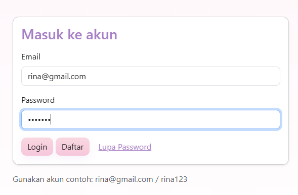
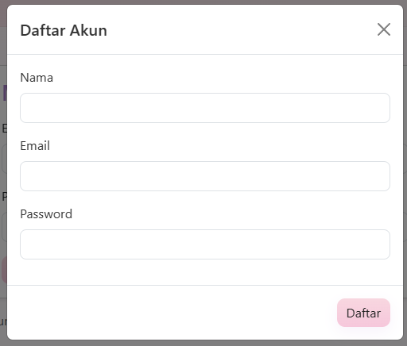
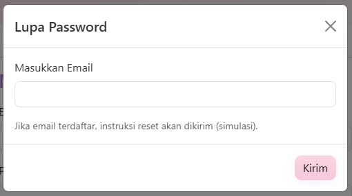
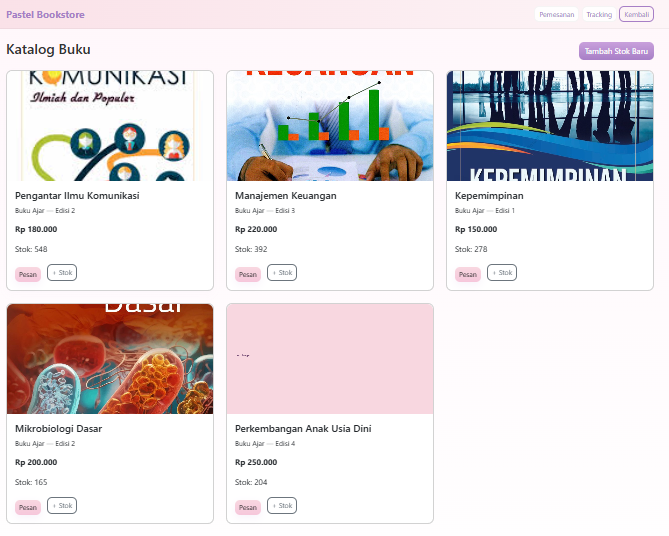

# 🌐 UTS PEMOGRAMAN WEB 1
🏫 **Universitas Pelita Bangsa**

💐 **Nama:** Leni

🆔 **NIM:** 312410442

💻 **Kelas:** TI.24.A5

👨‍💻 **Mata Kuliah:** Pemrograman Web

📅 **Dosen Pengampu:** Agung Nugroho, S.Kom., M.Kom

 ## 📂 **Struktur Folder Project**

```
tugas-uts-web1//
├── index.html        → (halaman login)
├── dashboard.html
├── stok.html
├── tracking.html
├── checkout.html
|-- css/
|   |-- style.css
|-- js/
|   |-- script.js
|   |-- data.js
|-- img/
|   |-- kepemimpinan.png
|   |-- manajemen_keuangan.png
|   |-- mikrobiologi.png
|   |-- paud_perkembangan.png
|   |-- pengantar_komunikasi.png
|   |--placeholder.png
└── README.md                # Dokumentasi proyek ini

```
## 📚 Bookstore: Aplikasi Manajemen Penjualan Buku (Front-End Sederhana)

Bookstore adalah sebuah simulasi aplikasi manajemen penjualan buku sederhana yang dibangun murni menggunakan teknologi front-end (HTML, CSS kustom, dan JavaScript). Proyek ini dirancang untuk menampilkan alur kerja dasar sebuah sistem penjualan, mulai dari Login, melihat Katalog, membuat Pemesanan (Checkout), hingga melihat Riwayat Transaksi dan Laporan.

```

## 🧩 Deskripsi Proyek

Website ini merupakan implementasi dari **Soal UTS Pemrograman Web 1**, dengan tema utama **Toko Buku Online**. Proyek ini dibuat menggunakan **HTML, CSS, dan JavaScript murni**, tanpa framework tambahan. Tujuan utama dari pembuatan website ini adalah untuk mempraktikkan konsep dasar:

* Struktur halaman web dengan HTML
* Pemisahan tampilan dengan CSS
* Manipulasi data dan DOM menggunakan JavaScript
* Penggunaan `localStorage` sebagai penyimpanan sementara data pengguna dan pesanan

```
### 1️⃣ Login & Registrasi Simulasi

* Pengguna dapat login menggunakan akun yang sudah ada di `data.js`.
* Validasi dilakukan dengan mencocokkan email dan password.
* Setelah login, data pengguna disimpan di `localStorage` agar bisa diakses di halaman lain.
* Fitur **lupa password** dan **daftar akun baru** disimulasikan menggunakan modal popup.

### Capture
#### Login

 

#### Registrasi

 

#### Lupa Password

 

### 2️⃣ Dashboard

* Setelah login, pengguna diarahkan ke **dashboard.html**.
* Menampilkan **greeting otomatis** berdasarkan waktu (pagi, siang, sore, malam).
* Memuat nama pengguna yang sedang login.
* Menyediakan navigasi cepat ke halaman stok/katalog, checkout, dan tracking,laporan, history.

### Capture

 

### 3️⃣ Katalog Buku (stok.html)

* Menampilkan tabel berisi daftar buku dari variabel `dataKatalogBuku`.
* Setiap buku menampilkan: kode, cover, nama, jenis, edisi, stok, dan harga.
* Dapat menambahkan buku baru melalui form tanpa reload halaman (menggunakan manipulasi DOM).

### Capture

 

### 4️⃣ Pemesanan & Checkout (checkout.html)

* Pengguna dapat memilih buku dari dropdown yang diambil dari `dataKatalogBuku`.
* Jumlah item bisa diatur sebelum dimasukkan ke keranjang.
* Semua item yang ditambahkan ke keranjang ditampilkan dalam tabel dengan opsi hapus.
* Setelah mengisi data pemesan dan metode pembayaran, sistem akan membuat nomor **Delivery Order (DO)** secara otomatis.
* Pesanan disimpan ke `localStorage` untuk simulasi penyimpanan database.

### Capture


### 5️⃣ Tracking & History Pesanan

#### Untuk User:
* Pengguna dapat mencari status pengiriman berdasarkan nomor DO
* Melihat detail lengkap pesanan dan status terkini
* Melihat riwayat update status pesanan
* Akses ke history pemesanan pribadi

#### Untuk Admin:
* Melihat semua pesanan yang masuk
* Mengkonfirmasi pesanan baru dengan tombol "Terima Pesanan"
* Mengupdate status pesanan melalui dropdown:
  - Sedang Diproses
  - Dalam Pengiriman
  - Selesai
* Setiap update status otomatis tercatat dengan timestamp

### Capture


---

## 🎨 Desain & Tampilan

* Warna dominan **biru (#2b6cb0)** dan **putih**.
* Desain menggunakan konsep **clean minimalis**.
* Layout menggunakan **Flexbox** dan **CSS Grid**.
* Semua tombol, input, dan elemen UI diseragamkan agar konsisten di setiap halaman.

---

LINK TUGAS (https://youtu.be/4xcz86bI788)
